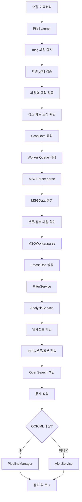

+

# MSG 처리 모듈 상세 설명

## 1. 개요

MSG 처리 모듈은 디코더가 생성한 `.MSG` 메타파일을 기준으로 하나의 이벤트를 구성하고, 관련 본문/첨부 파일을 수집해 분석, 저장, 색인, 알림, 후처리 파이프라인으로 전달하는 모듈이다.

이 프로젝트의 `.MSG`는 Outlook의 OLE/MAPI `.msg` 파일이 아니다. 내부 구조는 바이너리 메시지 컨테이너가 아니라 다음과 같은 텍스트 기반 정보 파일이다.

```text
[WMAIL]
CTIME : 2025/11/04 15:10:28
SOURCEIP : 1.225.49.101
DESTINATIONIP : 216.239.36.21
SOURCEPORT : 57793
HOST : askaichat.app
URL : /api/chat/message/send
MSGFILE : 20251104151028-...http-2.txt
APPFILE[0] : 20251104151011-...http-1-0.attach
```

즉 `.MSG` 파일은 실제 본문과 첨부를 직접 담지 않고, 본문 파일명과 첨부 파일명을 참조하는 메타데이터 역할을 한다.

## 2. 전체 처리 흐름



## 3. 주요 구성요소

| 구성요소 | 파일 | 역할 |
|---|---|---|
| 스캐너 | `FileScanner.java` | 수집 디렉터리에서 `.msg` 파일을 찾고 처리 가능 여부를 판단한다. |
| 작업 데이터 | `ScanData.java` | 파일 경로, 파일명, 크기, 파일명 파싱 결과, 파싱/색인 결과를 담는다. |
| 파일명 파서 | `FileNameInfo.java` | `.MSG` 파일명에서 시간, IP, 포트, 장비명 등을 추출한다. |
| MSG 파서 | `MSGParser.java` | `.MSG` 텍스트를 읽어 `MSGData` 객체로 변환한다. |
| MSG 모델 | `MSGData.java` | `.MSG` 입력 필드의 내부 표현이다. |
| 첨부 확장 정보 | `AttachExtension.java` | `EXTENSION[n]` 값을 확장자, 분석 방식, 암호화 여부 등으로 해석한다. |
| 공통 워커 | `AbstractWorker.java` | 파싱 이후 필터링, 분석, 전송, 색인, 통계, 알림 흐름을 실행한다. |
| MSG 워커 | `MSGWorker.java` | `MSGData`를 OpenSearch 문서인 `EmassDoc`으로 변환한다. |

## 4. 입력 파일 구조

### 4.1 `.MSG` 파일명

스캐너는 `.msg` 확장자를 가진 파일만 대상으로 한다. 파일명은 다음 구조를 기대한다.

```text
WMAILyyyyMMddHHmmss-srcIpHex-dstIpHex-srcPort-dstPort-seq-cid-device-decodeHost-기타.MSG
```

예:

```text
WMAIL20251104151028-01e13165-d8ef2415-57793-443-00-462358-DEBDA8FBC3951135ED28B45CFD0FAB8B-VI01.http-2.MSG
```

파일명에서 추출되는 값:

| 위치 | 의미 | 예 |
|---|---|---|
| `WMAIL20251104151028` | prefix + 생성 시간 | `20251104151028` |
| `01e13165` | source IP hex | `1.225.49.101` |
| `d8ef2415` | destination IP hex | `216.239.36.21` |
| `57793` | source port | `57793` |
| `443` | destination port | `443` |
| `00` | sequence | `0` |
| `462358` | cid | `462358` |
| `...` | device name | 장비/포트 식별값 |
| `VI01...` | decode host/suffix | 디코더 호스트 및 잔여 정보 |

스캐너는 파일명에서 다음을 검증한다.

- `WMAIL` prefix와 14자리 시간 문자열
- source/destination IP hex 형식
- source/destination port가 `0` 이상 `65535` 이하인지
- sequence가 숫자인지
- device/decodeHost 파트가 비어 있지 않은지

### 4.2 `.MSG` 파일 본문

`.MSG` 파일은 라인 기반 텍스트다.

```text
KEY : VALUE
KEY[0] : VALUE
KEY[1] : VALUE
[SECTION]
```

파싱 규칙:

| 규칙 | 설명 |
|---|---|
| 섹션 라인 | `[WMAIL]`처럼 대괄호로 감싼 라인은 `SVCKIND` 값으로 저장된다. |
| 일반 라인 | 첫 번째 `:` 기준으로 key와 value를 나눈다. |
| 배열 라인 | `APPFILE[0]` 같은 형식은 리스트로 저장된다. |
| 공백 처리 | key와 value 양끝 공백은 제거된다. |
| 중복 key | 일반 key는 나중 값이 이전 값을 덮는다. |
| value 내부 콜론 | 첫 번째 `:`만 구분자로 쓰므로 value 내부 `:`는 유지된다. |

## 5. 필수 필드

`MSGParser`는 파싱 후 다음 필드를 필수로 검사한다.

| 필드 | 설명 | 없을 때 |
|---|---|---|
| `CTIME` | 이벤트 발생 시간 | 파싱 실패 |
| `SOURCEIP` | 송신 IP | 파싱 실패 |
| `SOURCEPORT` | 송신 포트 | `0`이면 실패 |
| `DESTINATIONIP` | 목적지 IP | 파싱 실패 |
| `HOST` | HTTP host | 파싱 실패 |
| `URL` | HTTP URL path | 파싱 실패 |
| `STYPE` | 서비스 타입 | 파싱 실패 |

추가 제약:

- `URL_PARAMS`가 있고 길이가 `10000`자를 초과하면 실패한다.
- `STYPE`은 `MSGWorker`에서 다시 4자리인지 검증한다.
- `ACTION`이 없으면 기본값은 `ALLOW`다.

## 6. 주요 필드 설명

### 6.1 시간/네트워크

| MSG 키 | 내부 필드 | 설명 |
|---|---|---|
| `CTIME` | `ctime` | 이벤트 발생 시각 |
| `SOURCEIP` | `sourceIp` | 송신 IP |
| `SOURCEPORT` | `sourcePort` | 송신 포트 |
| `DESTINATIONIP` | `destinationIp` | 목적지 IP |
| `PROTOCOL` | `protocol` | `http`, `h2`, `websocket` 등 |

주의할 점은 최종 `EmassDoc.Network`에는 `.MSG` 내부 IP/포트가 아니라 파일명에서 파싱된 `FileNameInfo` 값이 사용된다는 점이다. 즉 색인 네트워크 정보의 기준은 파일명이다.

### 6.2 HTTP

| MSG 키 | 내부 필드 | 설명 |
|---|---|---|
| `HOST` | `host` | 요청 host |
| `URL` | `url` | path |
| `URL_PARAMS` | `query` | query string |

최종 HTTP URL은 다음 형태로 만들어진다.

```text
https://{HOST}:{destinationPortFromFileName}{URL}{URL_PARAMS}
```

### 6.3 본문

| MSG 키 | 내부 필드 | 설명 |
|---|---|---|
| `HDRFILE` | `header` | 헤더 파일명 |
| `MSGFILE` | `msgFile` | 본문 파일명 |
| `MSGSIZE` | `bodySize` | 본문 크기 |
| `CHARSET` | `bodyCharset` | 본문 charset |

`MSGFILE` 값은 실제 본문 파일의 파일명이다. 모듈은 설정의 `dataPath`와 split 디렉터리를 기준으로 실제 경로를 계산한다.

본문 처리 순서:

1. `MSGFILE` 값 확인
2. 실제 파일 존재 확인
3. 텍스트 추출
4. 설정 기반 길이 제한 적용
5. 설정 기반 토큰 제한 적용
6. Java escape 해제
7. `EmassDoc.Body`에 extension, path, size, text 저장

### 6.4 메일/메신저

| MSG 키 | 내부 필드 | 설명 |
|---|---|---|
| `SENDER`, `FROM`, `SEND_ID` | `from` | 발신자 |
| `TO` | `to` | 수신자 |
| `CC` | `cc` | 참조 |
| `BCC` | `bcc` | 숨은 참조 |
| `SUBJECT` | `subject` | 제목 |
| `MSGKEY`, `X-MTR`, `MESSAGE_ID` | `msgKey` | 메시지 고유 키 |
| `ROOTMTR` | `rootMtr` | 최상위 메시지 ID |
| `PARENTMTR` | `parentMtr` | 부모 메시지 ID |

### 6.5 첨부

| MSG 키 | 내부 필드 | 설명 |
|---|---|---|
| `PCFILE`, `ORG_FNAME` | `pcFile` | 사용자에게 보이는 원본 파일명 |
| `APPFILE`, `SERVER_FNAME` | `appFile` | 실제 저장된 첨부 파일명 |
| `EXTENSION` | `extension` | 첨부 분석 정보 |
| `FLINK` | `fLink` | 첨부 링크 정보 |
| `FLINKKEY` | `fLinkKey` | 첨부 링크 키 |
| `FSIZE` | `fSize` | 첨부 크기 |
| `ISBODYIMAGE` | `bodyImage` | 본문 이미지 여부 |

첨부는 인덱스 기준으로 묶인다.

```text
PCFILE[0] : 주민번호.png
APPFILE[0] : 20251104151017-...http-1-0.attach
EXTENSION[0] : 1|JPG|DETECTOR|JPEG/JIFF Image, JFIF standard|0
```

`EXTENSION[n]` 형식:

```text
파일명존재여부|확장자|분석방식|설명|암호화여부
```

첨부 처리 결과로 최종 문서에는 다음이 저장된다.

- 첨부 표시 이름
- 실제 소스 경로
- 저장소 목적지 경로
- 파일 존재 여부
- 파일 크기
- SHA-256 hash
- 확장자
- 파일명 존재 여부
- 첨부 ID

### 6.6 정책/탐지

| MSG 키 | 내부 필드 | 설명 |
|---|---|---|
| `ACTION` | `action` | 정책 처리 결과 |
| `REASON` | `reason` | 차단 사유 |
| `RULE_SEQ` | `ruleSeq` | 정책 번호 |
| `DETECTIONS` | `detections` | 탐지 상세 |
| `RESULT` | `result` | EP 전용 결과 |
| `OPINION` | `opinion` | 결재/의견 파일 경로 |

`ACTION`이 없으면 `ALLOW`로 처리된다. `ACTION`이 `ALLOW`가 아니고 `STYPE`이 3자리이면 송신 서비스로 간주해 뒤에 `S`를 붙인다.

## 7. `MSGData`에서 `EmassDoc` 변환

`MSGWorker`는 파싱된 `MSGData`를 색인용 `EmassDoc`으로 변환한다.

변환 항목:

| 대상 | 처리 내용 |
|---|---|
| `msgid` | `CTIME`과 `.MSG` 파일 경로 기반으로 생성 |
| `action` | 문자열을 `ActionType` enum으로 변환 |
| `ruleSeq` | 정책 번호 설정, 정책명이 있으면 추가 조회 |
| `timestamp` | `CTIME` 기준 Date 생성 |
| `ctime` | `yyyyMMddHHmmss` 형식 문자열 |
| `ltime` | 처리 시작 시간 |
| `service` | `STYPE` 4자리를 `svc1`, `svc2`, `svc3`, `svc12`로 분해 |
| `network` | 파일명 기반 source/destination IP/port 설정 |
| `http` | host, destination port, URL, query를 조합 |
| `body` | 본문 파일 텍스트와 크기 저장 |
| `attach` | 첨부 목록, 존재 개수, 총 크기 저장 |
| `processStatus` | OCR/ML 후처리 대상 여부 설정 |

`STYPE` 예:

```text
IASS
```

분해 결과:

| 항목 | 값 |
|---|---|
| `svc1` | `I` |
| `svc2` | `AS` |
| `svc3` | `S` |
| `svc12` | `IAS` |

## 8. 공통 워커 파이프라인

`AbstractWorker`는 큐에서 `ScanData`를 꺼내 다음 순서로 처리한다.

1. 파일 존재 여부 확인
2. 처리 시작 시간 기록
3. `.MSG` 파싱
4. 본문/첨부 참조 파일 확인
5. `EmassDoc` 생성
6. 필터링
7. 분석
8. 인사정보 매핑
9. Room ID 생성
10. INFO 파일 전송
11. 본문 파일 전송
12. 첨부 파일 전송
13. 첨부 내부 객체 전송
14. OpenSearch 색인
15. 통계 생성
16. OCR/ML 후처리 태스크 전달
17. 후처리 대상이 아니면 알림 전송
18. 원본 정리
19. 처리 로그 기록

## 9. 저장/전송 대상

처리 중 다음 파일들이 저장소로 전송된다.

| 전송 함수 | 대상 |
|---|---|
| `transToInfo` | `.MSG` 메타파일 |
| `transToBody` | `MSGFILE` 본문 파일 |
| `transToAttach` | `APPFILE[n]` 첨부 파일 |
| `transToAttachEmbedded` | 첨부 내부에서 추출된 객체 |

목적지 경로는 `CTIME`과 `msgid`를 기준으로 구성된다.

```text
{attachRoot}/{yyyyMMdd}/{HH/mm}/{msgid}/{fileName}
```

## 10. 필터링과 분석

문서 생성 후 `FilterService`가 먼저 실행된다. 필터링된 데이터는 분석/색인/후처리 흐름으로 가지 않고 정리와 로그 기록 단계로 넘어간다.

필터링되지 않은 데이터는 `AnalysisService`로 전달되어 키워드, 개인정보, 첨부, 언어, GuardRail, 이상점수 등 프로젝트에 연결된 분석 로직을 수행한다.

## 11. 인사정보 매핑

인사정보 매핑은 source IP 또는 설정된 식별 모드에 따라 사용자 정보를 찾는다.

설정이 `PORT` 모드이고 파일명 내 deviceName이 숫자이면 proxy port로 사용한다. 매핑 성공 시 최종 문서의 user 영역에 다음 정보가 채워진다.

- 사용자 ID
- 이름
- 대표 여부
- 부서 코드/명
- 직급 코드/명
- source IP
- proxy port

## 12. Room ID 생성

서비스 코드의 첫 글자가 `I`이면 생성형 AI 계열로 보고 Room ID를 생성한다.

생성 기준:

```text
base64({svc12}_{userId 또는 sourceIp})
```

사용자 ID가 없으면 source IP를 사용한다.

## 13. OCR/ML 후처리

색인 후 `PipelineManager`에 데이터를 전달한다.

- 후처리 대상이면 OCR/ML 워커가 이어서 처리한다.
- 후처리 대상이 아니면 즉시 알림을 전송한다.

기본 `processStatus`는 OCR은 `N`이다. ML은 조건에 따라 `P`로 설정될 수 있다. 차단 데이터는 첨부 후처리 대상에서 제외되는 흐름이다.

## 14. 오류 처리

| 오류 상황 | 처리 |
|---|---|
| 파일명 규칙 오류 | NOK 디렉터리로 이동 |
| `.MSG` 파일 읽기 실패 | NOK 이동 |
| 필수 필드 누락 | NOK 이동 |
| `URL_PARAMS` 길이 초과 | NOK 이동 |
| `STYPE` 없음 또는 4자리 아님 | NOK 이동 |
| 파싱/문서 변환 실패 | NOK 이동 |
| 필터 처리 실패 | NOK 이동 |
| 참조 파일 미도착 | 대기 시간 이내면 스캔 대상에서 제외하고 다음 주기 재확인 |
| 참조 파일 장기 미도착 | 로그 기록 후 가능한 처리를 계속하거나 이후 단계에서 존재하지 않음으로 처리 |
| 전송/색인/인사매핑 실패 | 최대 3회 재시도 후 NOK 이동 |
| 예외 미분류 | NOK 이동 |

처리가 끝나면 성공/실패와 관계없이 처리 중복 방지 캐시에서 해당 파일 경로를 제거한다.

## 15. 운영 관점 요약

이 모듈에서 이벤트의 기준은 `.MSG` 파일이다. `.MSG`가 발견되어야 본문과 첨부도 함께 처리된다.

본문과 첨부는 `.MSG` 안에 들어 있는 것이 아니라 별도 파일로 저장되어 있고, `.MSG`의 `MSGFILE`, `APPFILE[n]`, `HDRFILE` 필드가 이를 참조한다.

최종 색인 문서는 `MSGData`가 아니라 `EmassDoc`이다. `MSGData`는 입력 메타파일을 그대로 표현하는 중간 객체이고, `EmassDoc`은 검색/분석/알림을 위한 정규화된 출력 객체다.

파일명 정보와 `.MSG` 내부 정보가 모두 존재하지만, 최종 네트워크 정보는 파일명 파싱 결과를 기준으로 구성된다. 따라서 파일명 규칙이 깨지면 정상적인 색인까지 도달할 수 없다.

## 16. 관련 문서

- `docs/msg-module-overview.md`: 마인드맵과 흐름도 중심의 요약 문서
- `docs/msg-module-detail.md`: 전체 기능과 상세 설명 문서

