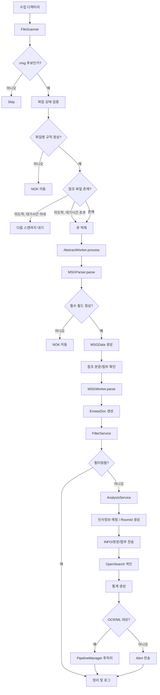

# MSG 처리 모듈 기능 정리

이 문서는 LogVault의 `.MSG` 처리 흐름을 모듈 관점에서 정리한다. 여기서 말하는 `.MSG`는 Outlook OLE/MAPI 원본 메시지 파일이 아니라, 디코더가 생성한 `KEY : VALUE` 형식의 텍스트 메타파일이다.

## 전체 마인드맵

```mermaid
mindmap
  root((MSG 처리 모듈))
    입력
      ".MSG 메타파일"
        "KEY : VALUE 텍스트"
        "[WMAIL] 섹션"
        "PCFILE[n] / APPFILE[n]"
      "참조 파일"
        "HDRFILE: 헤더"
        "MSGFILE: 본문"
        "APPFILE[n]: 첨부"
      "파일명 메타정보"
        "WMAILyyyyMMddHHmmss"
        "src/dst IP hex"
        "src/dst port"
        "seq/cid/device/decodeHost"
    스캔
      FileScanner
        "최대 depth 2 탐색"
        ".msg 확장자 선별"
        "0 byte/hidden/permission 제외"
        "파일명 상세 검증"
        "참조 파일 도착 여부 확인"
        "중복 처리 방지"
    파싱
      MSGParser
        "UTF-8 safe read"
        "라인 단위 key/value 파싱"
        "배열 키 처리: KEY[n]"
        "FieldKey 기반 MSGData 매핑"
        "필수 필드 검증"
        "msgid/action 기본값 생성"
    데이터
      MSGData
        "시간/네트워크"
        "HTTP"
        "본문"
        "메일/메신저"
        "첨부"
        "정책/탐지"
        "메시지 관계"
      EmassDoc
        "OpenSearch 색인 문서"
        "서비스 코드 분해"
        "본문 텍스트"
        "첨부 메타정보"
    처리
      MSGWorker
        "MSGData -> EmassDoc 변환"
        "STYPE 4자리 검증"
        "HTTP URL 구성"
        "본문 텍스트 추출"
        "첨부 존재/크기/hash 계산"
      AbstractWorker
        "필터링"
        "분석"
        "인사정보 매핑"
        "파일 전송"
        "색인"
        "통계"
        "OCR/ML 후처리"
        "알림"
    출력
      저장소
        "INFO(.MSG) 전송"
        "본문 파일 전송"
        "첨부 파일 전송"
        "첨부 내부 객체 전송"
      OpenSearch
        "EmassDoc 색인"
      후처리
        "OCR"
        "ML"
        "Alert"
      운영
        "처리 로그"
        "NOK 이동"
        "통계 생성"
```

## 처리 흐름도



## 모듈별 역할

| 모듈 | 주요 역할 |
|---|---|
| `FileScanner` | 수집 디렉터리에서 `.msg` 파일을 찾고, 파일명/권한/참조 파일 상태를 검증한 뒤 큐에 넣는다. |
| `ScanData` | 스캔된 파일의 경로, 파일명, 크기, 수정시각, 파일명 파싱 정보, 처리 결과 객체를 담는 작업 단위다. |
| `FileNameInfo` | `.MSG` 파일명에서 시간, IP, 포트, seq, cid, device, decodeHost 정보를 추출한다. |
| `MSGParser` | `.MSG` 텍스트를 읽어 `MSGData`로 변환하고 필수 필드와 기본값을 보정한다. |
| `MSGData` | `.MSG` 메타파일의 실질적인 스키마다. `@FieldKey`로 입력 키와 내부 필드를 연결한다. |
| `AttachExtension` | `EXTENSION[n]` 값을 파일명 존재 여부, 확장자, 분석 방식, 설명, 암호화 여부로 해석한다. |
| `AbstractWorker` | 공통 처리 파이프라인을 실행한다. 파싱, 필터링, 분석, 전송, 색인, 통계, 알림, 정리를 담당한다. |
| `MSGWorker` | MSG 전용 변환 로직이다. `MSGData`를 `EmassDoc`으로 만들고 본문/첨부 정보를 채운다. |
| `EmassDoc` | OpenSearch에 색인되는 최종 문서 모델이다. |

## 입력 파일 규격

### 파일명 규격

스캐너는 `.msg` 확장자를 가진 파일을 대상으로 삼고, 파일명은 다음 계열을 기대한다.

```text
WMAILyyyyMMddHHmmss-srcIpHex-dstIpHex-srcPort-dstPort-seq-cid-device-decodeHost-... .MSG
```

예:

```text
WMAIL20251104151028-01e13165-d8ef2415-57793-443-00-462358-DEBDA8FBC3951135ED28B45CFD0FAB8B-VI01.http-2.MSG
```

검증 항목:

- `WMAIL` prefix와 14자리 시간값
- source/destination IP hex 문자열
- source/destination port 범위: `0`부터 `65535`
- seq 숫자 형식
- device/decodeHost 파트 공백 여부

### MSG 본문 규격

`.MSG` 파일은 UTF-8 텍스트로 읽힌다. 깨진 문자는 replacement 처리된다.

```text
[WMAIL]
CTIME : 2025/11/04 15:10:28
SOURCEIP : 1.225.49.101
DESTINATIONIP : 216.239.36.21
SOURCEPORT : 57793
HOST : askaichat.app
URL : /api/chat/message/send
HDRFILE : 20251104151028-...http-2.hdr
MSGFILE : 20251104151028-...http-2.txt
SUBJECT : Chat & Ask AI Content
PROTOCOL : http
STYPE : IASS
ROOTMTR : 1762235435967
PCFILE[0] : normal.txt
APPFILE[0] : 20251104151011-...http-1-0.attach
EXTENSION[0] : 1|TXT|SYNAP||0
```

파싱 규칙:

- `[WMAIL]` 라인은 `SVCKIND=WMAIL`로 저장된다.
- 일반 라인은 첫 번째 `:` 기준으로 key/value가 나뉜다.
- `KEY[n]` 형식은 `List`로 변환된다.
- value 내부의 `:`는 보존된다.
- 같은 key가 반복되면 마지막 값이 남는다. 단, 배열 key는 인덱스별로 저장된다.

## 주요 필드

| MSG 키 | 내부 필드 | 설명 |
|---|---|---|
| `CTIME` | `ctime` | 이벤트 발생 시간 |
| `SOURCEIP` | `sourceIp` | 송신 IP |
| `SOURCEPORT` | `sourcePort` | 송신 포트 |
| `DESTINATIONIP` | `destinationIp` | 목적지 IP |
| `HOST` | `host` | HTTP host |
| `URL` | `url` | HTTP path |
| `URL_PARAMS` | `query` | query string |
| `HDRFILE` | `header` | 헤더 파일명 |
| `MSGFILE` | `msgFile` | 본문 파일명 |
| `MSGSIZE` | `bodySize` | 본문 크기 |
| `CHARSET` | `bodyCharset` | 본문 charset |
| `SENDER`, `FROM`, `SEND_ID` | `from` | 발신자 |
| `TO`, `CC`, `BCC` | list | 수신자 |
| `SUBJECT` | `subject` | 제목 |
| `PROTOCOL` | `protocol` | `http`, `h2`, `websocket` 등 |
| `STYPE` | `svc` | 4자리 서비스 코드 |
| `PCFILE`, `ORG_FNAME` | `pcFile` | 원본 첨부 파일명 |
| `APPFILE`, `SERVER_FNAME` | `appFile` | 저장된 첨부 파일명 |
| `EXTENSION` | `extension` | 첨부 분석 정보 |
| `ACTION` | `action` | `ALLOW`, `BLOCK`, `SKIP`, `ERROR` 등 |
| `REASON` | `reason` | 정책 차단 사유 |
| `RULE_SEQ` | `ruleSeq` | 정책 번호 |
| `DETECTIONS` | `detections` | 정책 차단 상세 내용 |
| `MSGKEY`, `X-MTR`, `MESSAGE_ID` | `msgKey` | 메시지 고유 키 |
| `ROOTMTR` | `rootMtr` | 최상위 메시지 ID |
| `PARENTMTR` | `parentMtr` | 부모 메시지 ID |
| `USERIP` | `userIp` | 사용자 식별용 IP |
| `USER`, `LOGIN_ID` | `loginId` | 사용자 로그인 ID |

## 필수 필드와 실패 조건

`MSGParser`는 다음 필드가 없으면 파싱 실패로 처리한다.

| 필수 필드 | 실패 의미 |
|---|---|
| `CTIME` | 이벤트 시간을 만들 수 없음 |
| `SOURCEIP` | 송신 IP 없음 |
| `SOURCEPORT` | 송신 포트 없음 또는 `0` |
| `DESTINATIONIP` | 목적지 IP 없음 |
| `HOST` | host 없음 |
| `URL` | URL 없음 |
| `STYPE` | 서비스 타입 없음 |

추가 조건:

- `URL_PARAMS`가 있고 길이가 `10000`자를 넘으면 실패한다.
- `STYPE`은 `MSGWorker` 단계에서 4자리여야 한다.
- `ACTION`이 없으면 `ALLOW`로 보정된다.
- `ACTION`이 `ALLOW`가 아니고 `STYPE`이 3자리면 마지막에 `S`를 붙여 송신 서비스로 보정한다.

## 본문 처리

`MSGFILE`은 본문 파일명을 가리킨다. 실제 경로는 설정의 `dataPath`와 split 디렉터리를 기준으로 계산한다.

본문 처리 내용:

- 참조 파일 존재 확인
- 본문 텍스트 추출
- 설정된 글자 길이 제한 적용
- 설정된 토큰 제한 적용
- Java escape 해제
- `EmassDoc.Body`에 확장자, 저장 경로, 크기, 텍스트 저장

본문 파일이 없으면 본문 없이 계속 처리할 수 있다. 다만 파일이 아직 도착하지 않았고 대기 시간 이내라면 스캐너/워커가 처리를 미룬다.

## 첨부 처리

첨부는 인덱스 기반으로 묶인다.

```text
PCFILE[0] : 사용자가 본 원본 파일명
APPFILE[0] : 실제 저장된 첨부 파일명
EXTENSION[0] : 1|TXT|SYNAP||0
```

`EXTENSION[n]` 형식:

```text
파일명존재여부|확장자|분석방식|설명|암호화여부
```

예:

```text
1|JPG|DETECTOR|JPEG/JIFF Image, JFIF standard|0
```

첨부 처리 결과:

- 원본 파일명 설정
- 파일명에 `{`, `}`, `:`, `"`가 있으면 제거
- 실제 첨부 파일 존재 여부 확인
- 파일 크기 계산
- SHA-256 hash 계산
- 저장소 목적지 경로 계산
- 첨부 개수, 존재 개수, 총 크기 계산

## 최종 문서 변환

`MSGWorker`는 `MSGData`를 `EmassDoc`으로 변환한다.

주요 변환:

- `msgid` 설정
- `ACTION`을 enum으로 변환
- `RULE_SEQ`로 정책명 조회
- `CTIME`을 색인 timestamp로 설정
- `STYPE`을 `svc1`, `svc2`, `svc3`, `svc12`로 분해
- 파일명에서 network 정보를 구성
- `https://{HOST}:{dstPort}{URL}{URL_PARAMS}` 형태의 HTTP URL 생성
- 본문/첨부 정보 구성
- 송신 생성형 AI 서비스는 ML 후처리 후보로 표시
- 수신 서비스는 정렬을 위해 timestamp에 1ms를 추가

## 후속 처리

공통 워커 파이프라인은 다음 순서로 실행된다.

1. `MSGParser.parse`
2. 참조 본문/첨부 파일 확인
3. `MSGWorker.parse`
4. `FilterService.filter`
5. `AnalysisService.analyse`
6. 인사정보 매핑
7. Room ID 생성
8. INFO 파일 전송
9. 본문 파일 전송
10. 첨부 파일 전송
11. 첨부 내부 객체 전송
12. OpenSearch 색인
13. 통계 생성
14. OCR/ML 파이프라인 전송 또는 즉시 알림
15. 정리 및 처리 로그 기록

## 오류 처리

| 상황 | 처리 |
|---|---|
| 파일명 규칙 오류 | NOK 이동 |
| `.MSG` 읽기 실패 | NOK 이동 |
| 필수 필드 누락 | NOK 이동 |
| 파싱/변환 실패 | NOK 이동 |
| 필터링 오류 | NOK 이동 |
| 참조 파일 미도착 | 대기 시간 이내면 재스캔 대기 |
| 참조 파일 장기 미도착 | 존재하지 않는 파일로 기록 후 가능한 범위 처리 |
| 전송/색인/인사매핑 실패 | 최대 3회 재시도 후 NOK 이동 |

## 관련 코드 위치

| 파일 | 역할 |
|---|---|
| `src/main/java/com/xcurenet/logvault/module/scanner/FileScanner.java` | `.MSG` 파일 탐지, 파일명 검증, 참조 파일 확인 |
| `src/main/java/com/xcurenet/logvault/module/ScanData.java` | 스캔 작업 단위 |
| `src/main/java/com/xcurenet/common/types/FileNameInfo.java` | 파일명 메타정보 파싱 |
| `src/main/java/com/xcurenet/common/msg/MSGParser.java` | `.MSG` 텍스트 파싱 |
| `src/main/java/com/xcurenet/common/msg/MSGData.java` | MSG 입력 스키마 |
| `src/main/java/com/xcurenet/common/types/AttachExtension.java` | 첨부 확장 정보 파싱 |
| `src/main/java/com/xcurenet/logvault/module/worker/AbstractWorker.java` | 공통 워커 파이프라인 |
| `src/main/java/com/xcurenet/logvault/module/worker/MSGWorker.java` | MSG 전용 문서 변환 |
